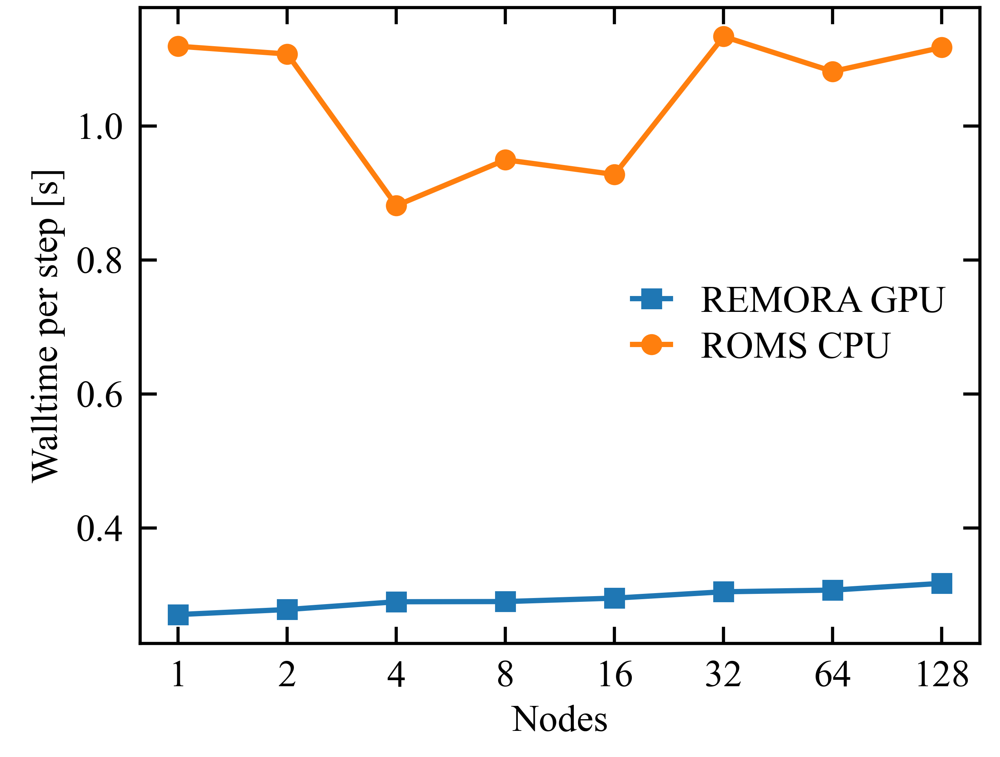
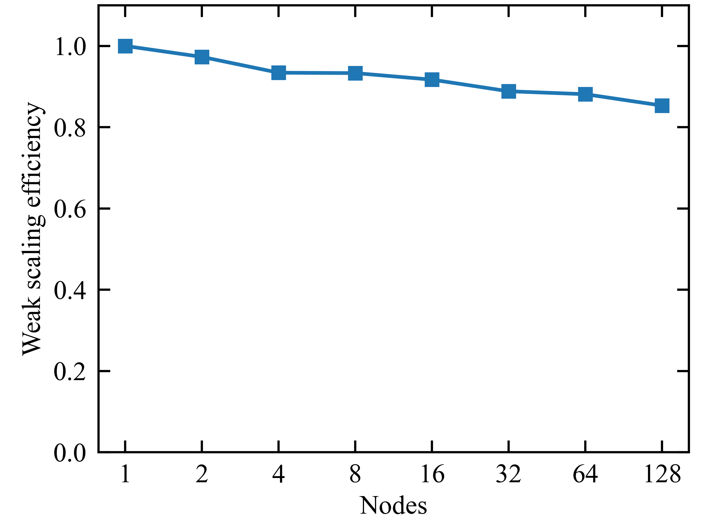
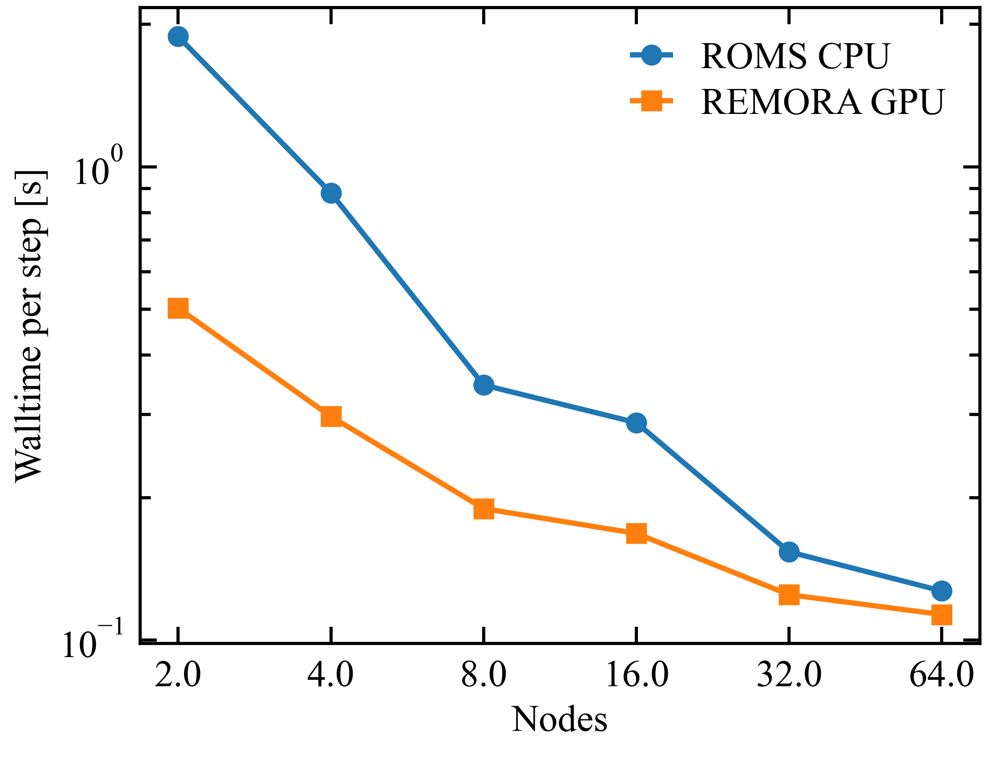

 .. role:: cpp(code)
    :language: c++

.. _Performance:

Performance
===========

GPU weak scaling
----------------

.. _fig:weak:

    Comparison of time per step for a weak scaling test of the upwelling problem in REMORA-GPU and ROMS.
    REMORA-GPU is generally 3-4x faster than ROMS for the same problem size on the same number of Perlmutter nodes.

    Weak scaling efficiency of REMORA on GPUs for the upwelling problem. Scaling efficiency stays high, over 85 percent to 128 nodes.

GPU strong scaling
------------------

    Comparison of time per step for a strong scaling test for the upwelling problem of 2048 by 1024 by 128 cells in the x, y, and vertical directions, respectively.
